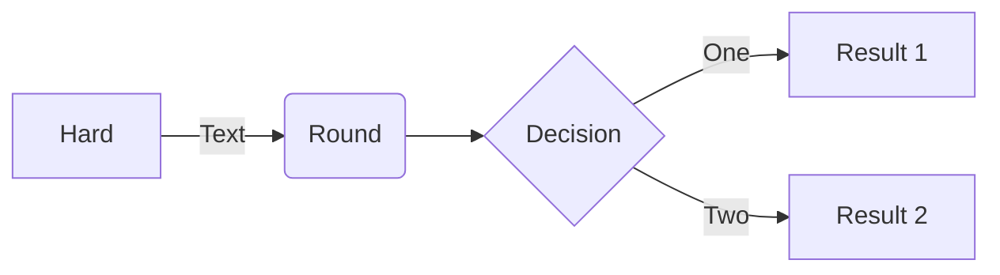

# BALANCE - A Game I Did Not Create
The goal of this project is to demonstrate how I would tackle the game of Balance with my experience while still holding true to the origianl design / implementation.  Hopefully it demonstrates a few key concepts:
* Separation of concerns - Objects should not be tightly coupled (i.e. change one thing shouldn't force you to change another)
* Single responsibilty princple - Each object should have only one reason to change
* DRY - Minimize the number of times you repeat code for any reason
* Enough of a framework that the code presented here could be used to develop other CLI games

## Features
This implementation of Balance offers the following features:
* A renderer using a back buffer that allows you to easy place images at specific `X` and `Y` cooridinates
* A few mechanisms to simplify colorizing text:
    * `StringUtils.color()` will color the entire string
    * `StringUtils.highlight()` will colorize words wrapped in `*` with the default or provided color
* A simple state machine to manage game state and turn state
* Incredibly basic introduction animation
* One example of inheritance

## Improvements
This implementation has a few areas that could be improved:
* Arrays could be used to hold all sprites
* The player and platform state / relationship could be better managed
* I am sure there are plenty of other things...

